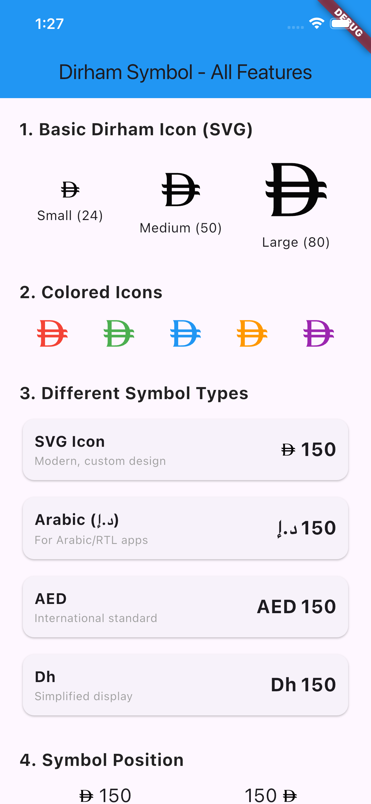
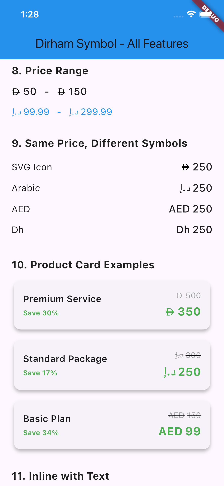
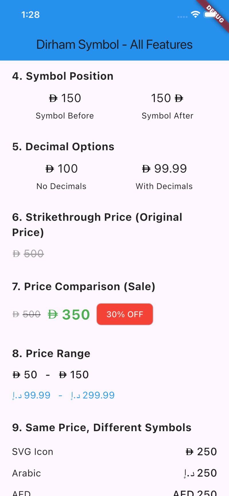
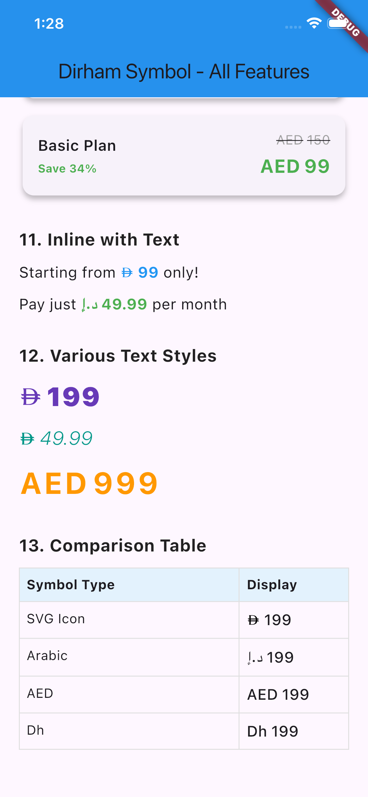

# Dirham Symbol

A flexible Flutter package for UAE Dirham currency display with multiple symbol options and price formatting.

[](https://pub.dev/packages/dirham_symbol)
[](https://opensource.org/licenses/MIT)

## Features

- Multiple symbol types: SVG icon, Arabic (د.إ), AED, Dh
- Customizable size, color, and text styling
- Price formatting with decimals and ranges
- Flexible symbol positioning
- RTL support

## Installation

```yaml
dependencies:
  dirham_symbol: ^0.2.1
```

## Quick Start

```dart
import 'package:dirham_symbol/dirham_symbol.dart';

// SVG icon
DirhamPrice(amount: 150, style: TextStyle(fontSize: 24))

// Arabic text
DirhamPrice(
  amount: 150,
  symbolType: DirhamSymbolType.arabic,
  style: TextStyle(fontSize: 24),
)

// AED or Dh
DirhamPrice(amount: 150, symbolType: DirhamSymbolType.aed)
DirhamPrice(amount: 150, symbolType: DirhamSymbolType.dh)
```

## Symbol Types

| Type | Display | Use Case |
|------|---------|----------|
| `icon` | SVG | Modern apps |
| `arabic` | د.إ | Arabic/RTL apps |
| `aed` | AED | International apps |
| `dh` | Dh | Simplified display |

## Common Examples

### With Decimals
```dart
DirhamPrice(amount: 99.99, showDecimals: true)
```

### Symbol Position
```dart
DirhamPrice(amount: 250, symbolBefore: false) // 250 د.إ
```

### Price Range
```dart
DirhamPriceRange(minAmount: 50, maxAmount: 150)
```

### Sale Pricing
```dart
Row(
  children: [
    DirhamPrice(
      amount: 500,
      style: TextStyle(
        decoration: TextDecoration.lineThrough,
        color: Colors.grey,
      ),
    ),
    SizedBox(width: 10),
    DirhamPrice(
      amount: 350,
      style: TextStyle(
        fontSize: 24,
        fontWeight: FontWeight.bold,
        color: Colors.green,
      ),
    ),
  ],
)
```

## Main Widgets

### DirhamPrice
```dart
DirhamPrice(
  amount: 150,              // required
  symbolType: DirhamSymbolType.icon,
  style: TextStyle(),
  showDecimals: false,
  symbolBefore: true,
  iconSize: null,           // auto-calculated
  iconColor: null,          // inherits from style
)
```

### DirhamPriceRange
```dart
DirhamPriceRange(
  minAmount: 50,            // required
  maxAmount: 150,           // required
  symbolType: DirhamSymbolType.icon,
  style: TextStyle(),
  showDecimals: false,
)
```

### DirhamIcon
```dart
DirhamIcon(size: 24, color: Colors.black)
```

## Requirements

- Flutter: >=3.0.0
- Dart: >=3.0.0 <4.0.0

## License

MIT License - see [LICENSE](LICENSE) for details.

## Screenshots

### Main Feature


### Examples


### Symbol Positions


### Price Comparison


## Links

- [GitHub](https://github.com/nadeerep07/dirham-symbol.git)
- [Issues](https://github.com/nadeerep07/dirham-symbol.git)
- [pub.dev](https://pub.dev/packages/dirham_symbol)

---

Created with ❤️ for the Flutter community